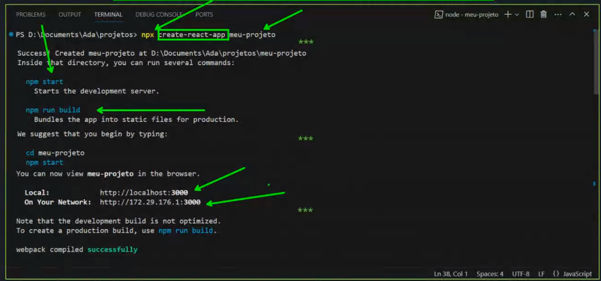

### Dicas Iniciais:

- Concentre-se em aprender o motivo por trás dos códigos e para que eles servem. Entender o que um código faz e por que o faz é muito mais importante do que simplesmente memorizá-lo.
- Se sentir que está ficando estagnado, considere a possibilidade de mudar de equipe, projeto e, até mesmo, de empresa.
- Ter conhecimento sobre o negócio é tão importante quanto ter conhecimento sobre código.

### Conteúdo Abordado:

- Modelagem baseada em componentes
- Props e PropTypes
- State e State Lifting
- React Router
- Renderização condicional e renderização de listas
- Composição de Componentes
- Formulários
- Ciclo de Vida

### Processo Avaliativo:

- Avaliação por rubrica, com feedback e autoavaliação na aula do dia 13/11.
- 2 listas de exercícios + um projeto

### Objetivos:

- Compreender o que é o React e qual é a sua motivação.
- Entender o conceito de componentes e a razão para componentizar uma aplicação.
- Identificar oportunidades para usar o React na resolução de problemas do mundo real.
- Aprender a criar um novo projeto usando o React.

### O que é React?
* Uma biblioteca JavaScript para criar interfaces de usuário;
* Foi criado pelo Facebook(atual Meta) a partir da necessidade de lidar com a complexidade de páginas dinâmicas(reativas);
* Popular por ser fácil de usar, altamente flexivel e escalável;
* Usado por muitas empresas de tecnologia, incluindo o Facebook, Instagram e Airbnb;
* Declarativo, baseado em componentes, aprenda uma vez, use em qualquer lugar.

### O que é uma biblioteca JavaScript?
* "Um conjunto de códigos pré-escrito que permite um desenvolvimento mais fácil de aplicativos baseados em JavaScript".

### Por que o React é tão popular?
* **Fácil de usar:** A sintaxe do React é simples e intuitiva, tornando-o fácil de aprender e usar;
* **Flexível:** O React é altamente flexível, permitindo que você crie interfaces de usuário complexas e personalizadas;
* **Escalabilidade**: O React é escalável, permitindo que você crie aplicações web que possam crescer com seu negócio;
* **Comunidade**: O React tem uma grande comunidade de desenvolvedores e desenvolvedoras que contribuem com código, recursos e suporte;
* **Foco em componentização:** O React é baseado no conceito de componentização, que permite que você crie *partes reutilizáveis* da interface de usuário.


### Modelagem baseada em componentes
* Componentes são **blocos de construção** de uma aplicação React;
* Cada componente é responsável por uma parte da UI (interface do usuário) que **possui lógica e aparência próprias**;
* Um componente pode ser **tão pequeno quanto um botão** ou **tão grande quanto uma página inteira**;
* Os componentes podem ser **reutilizados** em diferentes partes da aplicação;
* A componentização melhora a **manutenibilidade** e a **escalabilidade** da aplicação

##### Os componentes React são *funções JavaScript* que retornam marcação:

```
function MyButton() {
    return (
        <button> I'm a button</button>
    );
}
```

##### Agora que declaramos o componente *MyButton*, podemos aninhá-lo em outro componente:
```
export default function MyApp() {
    return (
        <div>
            <h1>Welcome to mu app</h1>
            <MyButton/>
        </div>
    );
}
```

##### Exemplos:
* **Input**: Um componente que representa um campo de texto;
* **Image**: Um componente que representa uma imagem;
* **List**: Um componente que representa uma lista de itens;
* **App**: Um componente que representa a aplicação inteira.


### O que é necessário para começar uma aplicação com React?
1. Instalação do Node;
2. Instalação do NPM;
3. Instalação do Visual Studio Code.


### Como come ar uma aplicação com React?
1. console -> 'npx(ou npm) create-react-app nome-do-projeto
2. cd nome-do-projeto
3. npm start


