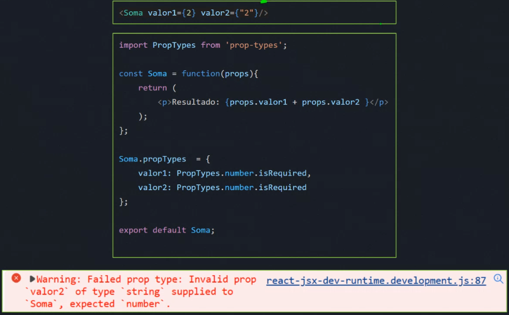

# Props e PropTypes

### O que é o JSX
- JSX vem de **Javascript XML** é uma **sintaxe** que **permite mesclar HTML e JavaScript** de forma fácil. É uma das principais características do React;
- É uma **extensão** de sintaxe do **JavaScript**;
- JSX pode lembrá-lo de uma linguagem de marcação, mas vem com todo o poder do JavaScript;
- JSX produz "elementos" React;
`const element = <h1>He110, world!</h1>;`

### Por que JSX?
- **Lógica de renderização acoplada a outras lógicas de UI**: JSX permite que a marcação e a lógica de renderização sejam escritas juntas, o que torna o código mais conciso e fácil de entender;
- **Componentes**: JSX permite que a marcação e a lógica de renderização sejam agrupadas em componentes, o que facilita a **reutilização** e a **manutenção do código**;
- **Código mais legível**: JSX deixa o código mais legível ao trabalhar com elementos dentro do código JavaScript;
- **Mensagens de erro e warning**: JSX permite que o React mostre mensagens de
erro e warning.

```
export default function LetsCode ( ) {
    const enterprise = "Let's Code"
    return (
        h1>Bem-vindo à { enterprise }
    </hl>
}
```

### Retornar um único elemento root
- Para retornar vários elementos de um componente, envolva-os com uma **única tag pai**.

(tag vazia <></> chama-se fragment)

### Feche todas as tags
- **JSX exige que todas as tags sejam explicitamente fechadas**: tags de fechamento automático como `` devem se tornar ``, e tags de encapsulamento como `<li>laranjas` devem ser escritas como `<li>laranjas</li>`

### camelCase
- **No JSX atributos HTML e SVG devem ser escritos em camelCase**: Isso ocorre porque o JavaScript tem limitações nos nomes de variáveis.
- Por exemplo, nomes de variáveis **não podem conter** - ou ser **palavras reservadas** como class.


## Class Components
### O que são class components?
- Class components são uma das duas formas de criar componentes React;
- Class componentes são a **forma mais antiga** de componentes React.
- Eles são baseados em **classes JavaScript** e fornecem **acesso ao state** e **ao ciclo de vida do React**;

Class Components
```
import { Componeht } from ' react '

class LetsCode extends Component {
    render() {
        const enterprise = "Let's Code"
        return (
            <h1>Bem vindos a { enterprise }</h1>
        )
    }
}

export default LetsCode
```

Functional Components
```
    export default function LetsCode ( ) {
        const enterprise = "Let's Code"
        return (
            <h1>Bem-vindo à { enterprise }</h1>
        )
    }
```


## Prosp
### O que são props?
- São **propriedades** que um componente pai passa para um componente filho;
- Servem para comunicar informações entre componentes;
- Podem ser de **qualquer tipo** de dado;
- São imutáveis no que diz respeito ao Componente que as recebe.

`<Hello name="Luis">`


### Encontre o erro:

** Erro: um valor é tipo number e outro string e não retorna o que é esperado

## PropTypes

** Pra quem usar typescript, o typescript resolve

### O que são PropTypes?
- É uma **biblioteca JavaScript** que permite validar props de componentes React;
- São úteis para evitar erros e garantir a **integridade dos dados**;
- Não é uma biblioteca nativa do React.

### Como usar PropTypes?
- Instale a biblioteca prop-types (**npm install prop-types**);
- Importe a biblioteca prop-types;
- Defina uma propriedade propTypes no componente React;
- Especifique os tipos de dados esperados para cada propriedade.



### Tipos de dados
