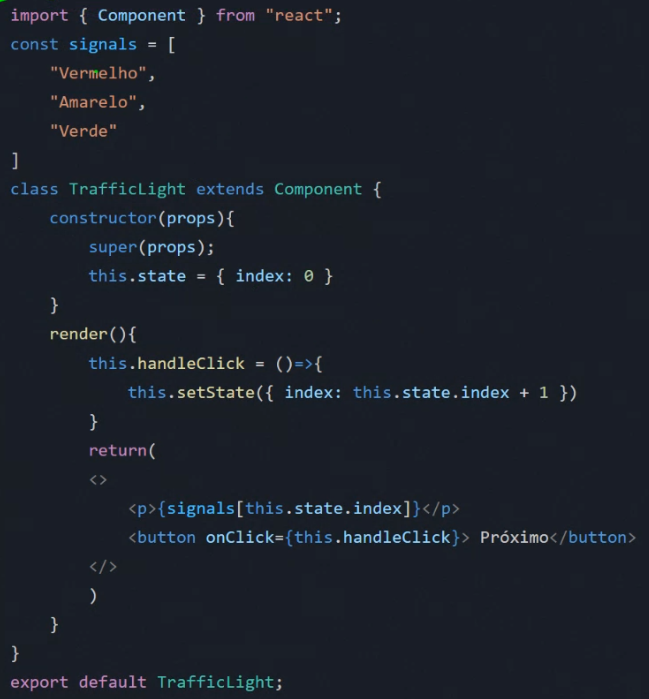
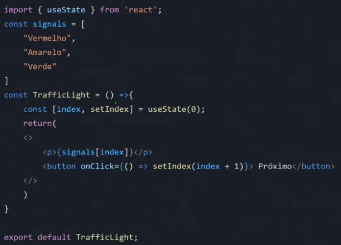
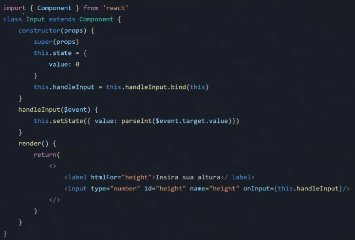
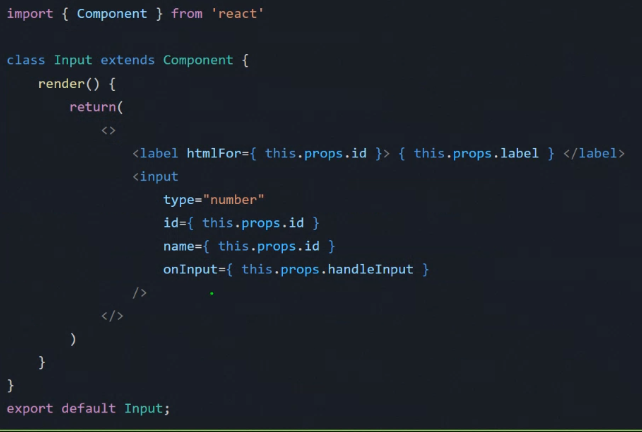
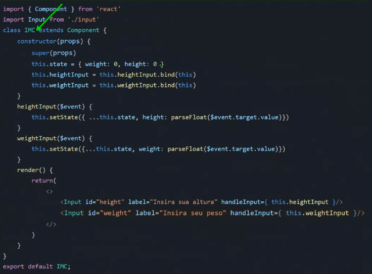

# State e State Lifting

## State

### O que é State?
- É a memória de um componente;
- Armazena dados que podem mudar longo do tempo;
- O estado do componente é onde ele armazena dados mutáveis sobre *como ele "está" no momento.*
Um bom exemplo para enxergarmos isto é o semáforo. Ele possui um estado interno que indica se está vermelho, amarelo ou verde, e cada um destes comunica uma coisa diferente ao usuário.

### Não é só usar uma variável? E as props?
- Não, uma variavel não faria renderizar o elemento que queremos e com props não são mutáveis e outros motivos

### Como usar State?
- Use o atributo **state** em um componente React;
- Defina as **propriedades do estado como objetos**;
- Use o método **setState()** para atualizar o esta o.
- Mudou o estado do elemento, é renderizado e usado poder computacional do usuario



### Como fica com function components?
- useState é um Hook que te permite adicionar o state do React a um componente de função.



Em geral, os Hooks começam com a palavra "use"​. Sempre que você ver essa palavra no início do nome de uma função, é muito provável que esteja vendo um Hook. Alguns exemplos são:

- useState;
- useEffect;
- useReducer;
- useContext;
- e muitos outros.

* Sintaxe do useState:
```
​const [liked, setLiked] = useState(false) // o valor de liked inicialmente é false
```

O ​useState​, ao ser executado, recebe um valor inicial e retorna um array com dois valores.

Podemos então pegar esses dois valores utilizando um ​destructuring assignment

O primeiro valor é a variável do nosso state com o valor inicial que passamos ao useState - no exemplo acima é false - enquanto o segundo é uma função que tem como papel alterar o valor da primeira.

É importante que o valor inicial represente aquilo que realmente desejamos para aquele state, mesmo que a princípio um valor ​undefined​ possa fazer sentido. Ou seja, se queremos que um state tenha uma ​string, devemos iniciá-lo com uma string vazia; se queremos um array, com um array vazio; e assim sucessivamente.

```
// com valores iniciais bem definidos, só de ler o código já sabemos qual
​// o tipo de dado que cada state possui
​const [liked, setLiked] = useState(false) // liked é do tipo boolean
​const [name, setName] = useState('') // name é do tipo string
​const [count, setCount] = useState(0) // count é do tipo number
​const [list, setList] = useState([]) // list é do tipo array
​const [pessoa, setPessoa] = useState({}) // pessoa é do tipo object
```

##### Utilizando e alterando o valor de um state
Após definir um state, podemos utilizá-lo dentro da nossa estrutura de HTML, sendo que, ao alterar seu valor utilizando o setState (o segundo valor que pegamos do useState), o React atualizará a página automaticamente.

Analisemos o seguinte exemplo:

```
function Counter() {
​  const [count, setCount] = useState(0)

  return (
    <div>
      <button onClick={() => setCount(count + 1)}>
        O count é: {count}
      </button>
    </div>
  )
}
```

Criamos um componente chamado ​Counter​, que retorna um HTML simples, com apenas uma ​​div​ e um ​button​;

Criamos um state chamando a função ​useState(0)​ e passando um valor inicial ​0​;

Definimos o texto do elemento ​button​ como sendo "O count é: {count}", que será exibido inicialmente como: "O count é: 0";

Colocamos uma ação de ​onClick​ nesse botão, que irá executar uma função anônima, que por sua vez chamará ​setCount(count + 1)​, que irá alterar o valor da variável ​count​, somando mais um em seu valor atual;

Sempre que o valor da variável ​count​ é alterado, o React reage​ a essa alteração e atualiza a exibição da página automaticamente.


## State Lifting

### O que é State Lifting?
- É o processo de mover o estado de um componente filho para um componente pai;
- Delegar a responsabilidade de manter o estado no componente pai;
- Pode ser usado para melhorar a reusabilidade e a organização do código centralizando as informações.







### Vantagens do State Lifting
- 

### Desvantagens do State Lifting
- Pode dificultar a compreensão do código;
- Pode aumentar a complexidade código.