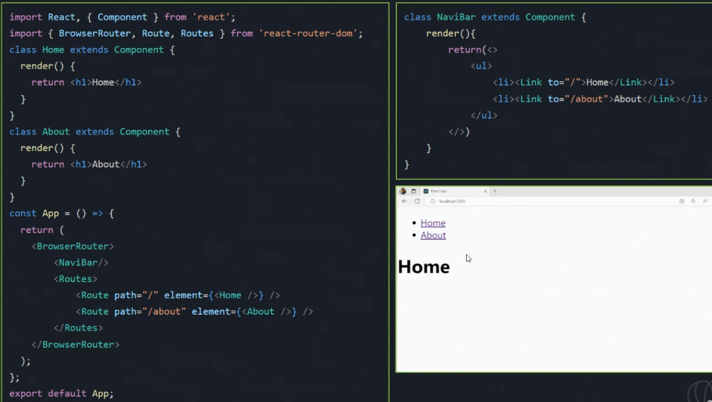

# React Router

#### Introdução: Roteamento de á inas tradicional

#### Introdução: Roteamento de páginas SPA

#### Introdução: SPA vs Tradicional

### O que são as Rotas?

- As rotas são a URL que representam os diferentes caminho para chegar
nas páginas da aplicação;

### O que é o React Router?

- O *React Router* é uma **biblioteca** que permite implementar o **roteamento do lado do cliente** em aplicações React;
- O React Router usa um padrão de roteamento REST para definir as rotas da aplicação.

### Como usar o React Router?

- Instale o React Router no projeto (**npm install react-router-dom**);
- Importe os componentes **BrowserRouter, Route, Routes** o arquivo App.js;
- Crie componentes para cada rota;
- Use o componente Routes para renderizar as rotas.

Ex:

### Como criar links de navegação?

- React Router fornece o componente Link para criar links de navegação;
- VER SLIDES

Ex:

