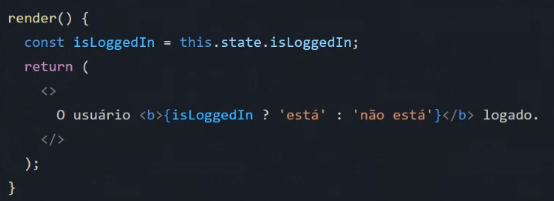

# Renderização condicional e renderização de listas

### O que é renderização condicional?
- A renderização condicional é uma técnica que permite ao React **renderizar apenas o conteúdo necessário**;
- A renderização condicional é útil para melhorar o desempenho e a
eficiência da aplicação;

### Renderização de listas
- A renderização de listas é uma técnica que permite ao React renderizar uma lista de elementos/componentes;
- A renderização de listas é útil para exibir dados em um formato de tabela ou lista.

