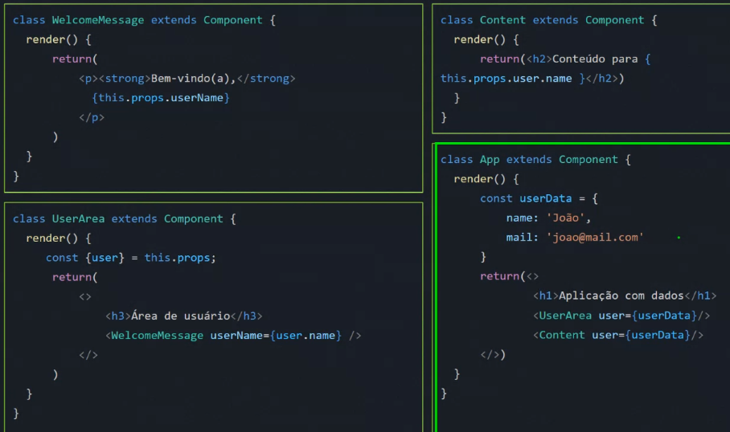
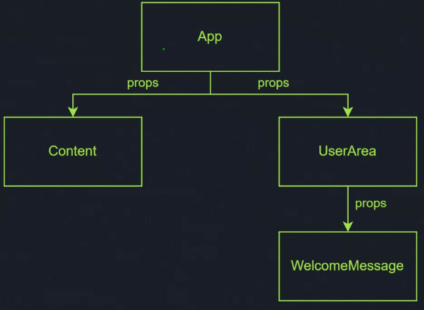
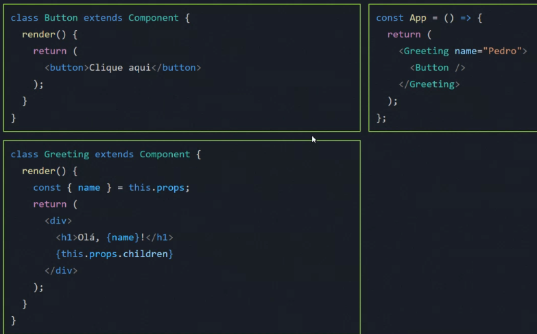
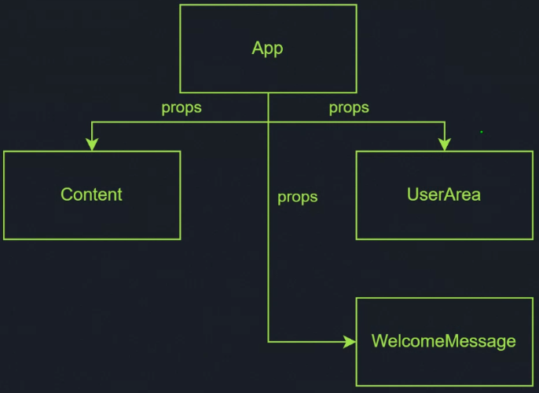

# Composição de Componentes

### O que é Prop Dril ling?
- Ver slides

### como resolver isso?
#### O que é composição?
- A composição é um **padrão de design** que permite que um componente seja criado a partir de outros componentes;
- Isso pode ser feito passando um componente como propriedade para criar um
novo componente.

