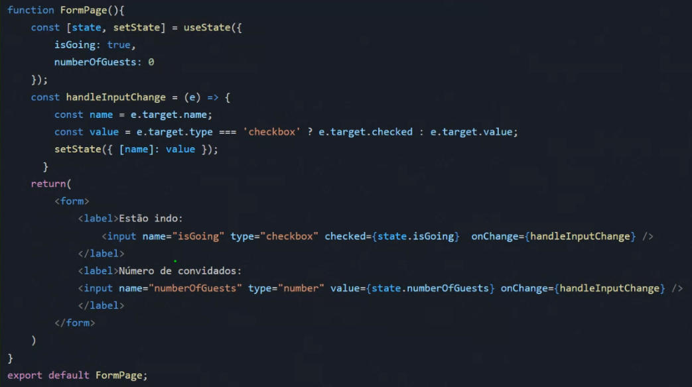

# Formulários

### Quais as características dos elementos de formulário?
* Elementos de formulário como **<input>, <textarea> e <select> mantêm**  aturalmente algum **estado interno**;
* O estado interno do elemento não afeta o estado do React e portanto esse componente **não é controlado pelo React por padrão**;
* O elemento form têm **comportamento padrão de navegação** para uma nova página.

### O que é um componente controlado?
- Um input cujo o **valor é controlado pelo React** é chamado de **componente controlado** (controlled component);
- O estado React é **única fonte da verdade**

### Como controlar uma entrada com uma variável de estado
- Um input não controlado **não tem um propriedade value** ou possui um valor undefined;
- Para renderizar um input controlado, **passe a propriedade value para ele**. O
React forçará o input a sempre ter o valor que você passou.

### Como evitar o comportamento padrão de navegação para outra página?

### Manipulandomultiplos input

### Validando os dados

https://formik.org/
https://react-hook-form.com/