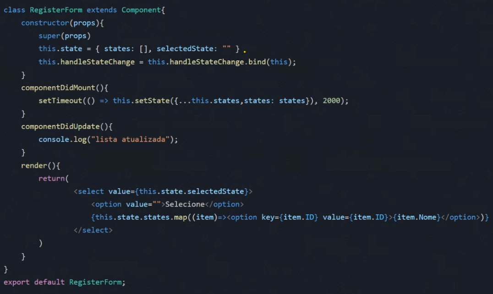

# Ciclo de Vida

### o que é o ciclo de vida de um componente?
* É uma **série de etapas** que um componente passa desde sua **criação até a desmontagem**;
* Essas etapas são executadas em uma **determinada ordem;**
* Permitem que os desenvolvedores executem código específico em **momentos específicos** do ciclo de vida do componente.

### Montagem (Mounting)
1. constructor();
2. render();
3. componentDidMount( ).

### constructor( )
* **O construtor é opcional**. Você só precisa implementar um construtor se precisar inicializar o estado ou fazer o bind dos metodos
* O construtor é chamado antes do componente ser renderizado;
* Quando você estiver implementando o construtor para uma subclasse de React.Component, você deve chamar super(props) antes de qualquer outra coisa;
* Os construtores de componentes React são usados principalmente para dois propósitos: Inicializar o state local, Ligar(bind) métodos manipuladores de eventos a uma instância.

### render( )
* O método **render() é obrigatório**. Todo componente React deve ter um método render( ) ;
* O método render() é responsável por **retornar a hierarquia de elementos** que será renderizada pelo React;
* O método render() é chamado **sempre que o componente for ser renderizado**;
* O método render() **deve ser uma função pura**. Isso significa que ele não deve ter efeitos colaterais, como modificar o estado ou o DOM.

### componentDidMount( )
* O método é chamado **após o componente ser montado** pela primeira vez;
* É um bom lugar para fazer alterações no DOM que não são necessárias na renderização inicial do componente (add eventos ao DOM, **carregar dados de API**, inicializar biblioteca externa);
* **Não é chamado em atualizações** do componente;

    

### Atualização(Updating)
1. render();
2. componentDidUpdate( ) .

### render( )
* O método render() é chamado sempre que o componente receber novas props, o método **setState()** ou forceUpdate() for chamado;

### componentDidUpdate( )
* O método componentDidUpdate() é chamado **após o componente ser atualizado;**
* É um bom lugar para fazer **alterações no DOM** que são necessárias **após a atualização do componente**;
* Não é chamado na primeira rendenzaçao do componente.

### Desmontagem(Unmounting)
### componentWillUnmount()
* O método componentWiIIUnmount() é chamado imediatamente **antes que um componente seja desmontado**;
* É um bom lugar para fazer **limpezas**, como **cancelar requisições de rede** ou
**remover listeners**;

