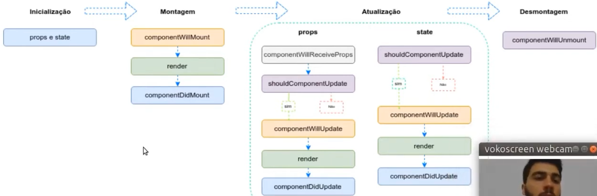

# Estado e Ciclo de Vida

# Estado

- Inicialização
- Montagem
- Atualização
- Desmontagem

Nenhum componente pai ou filho devem saber se outro componente possui estado ou não.

O estado é apenas local ao componente e caso seja necessário enviar algum atributo para outro então é feito via props.

# Ecossistema

Alguns Exemplos:

React Router;
Redux;
Material Ul;
Ant-Design;
Storybook;
Gatsby;
Jest;
React i18n Next.