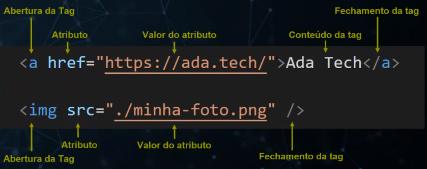
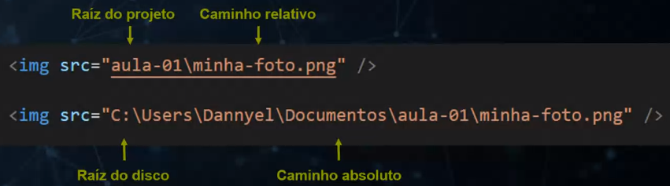
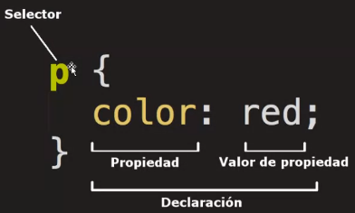

# Front end estático:

#### Estático:
vem da ideia que tenham dados que nao se modifique, uma animacao nao torna um pagina dinamica

#### Dinamismo de conteudo(dinâmico):
quando a pagina muda, como atualiza como postagem do instagram, dados que mudam conforme projetado, como wikipedia, mesmo template, o que muda é o conteudo

---

* Obs: é fundamental ter pensamento de estrutura de páginas em html

---


* HTMl - Estrutura
* CSS - estilização - folha de estilo em cascata

---

#### Extensao de arquivo
Uma extensão de arquivo nada mais é do que um sufixo capaz de nomear um formato e função próprios.
Ex: png, html, js, css

---

MIME Type
O MIME type é o mecanismo para dizer ao cliente a variedade de documentos transmitidos: a extensão de um nome de arquivo não tem significado na web. 
Portanto, é importante que o servidor esteja configurado corretamente, de modo que o MIME-type correto seja transmitido com cada documento. 
Os navegadores costumam usar o MIME-type para determinar qual ação usar como padrão para fazer quando um recurso é obtido.
cliente >> usuario
server >> máquinas que emulam  

No Network no navegador, no devtools, lá tem todas informações do servidor

Tipos discretos
text/plain
text/html
image/jpeg
image/png

---

#### Emmet 
Faz algus auto-complete, pela extensao do arquivo

---

#### Tags HTML


*  Tag que tem conteudo -> tag de bloco -> toda tag que tem abertura e fechamento
* tag de linha -> fecha na mesma tag de abertura



* no cmd:  
  * ls -> ve as pastas
  * cd -> change directory - mudar de diretorio, ex: cd Users/usuariosX/etc
    * pra sair 'cd ..' e de mais patas 'cd ../..'
  * mkdir -> make directory - criar nova pasta
  * remove - apaga a pasta 

Programador Web - trabalha muito com caminho relativo

---

#### Seletor CSS - Tag



--- 
#### Estrutura básica + adendos- HTML

```html
<!DOCTYPE html>
<html lang="pt-br">
<head> <!-- cabeça do documento, metadados e configurações -->
    <meta charset="UTF-8"> <!-- tag meta pode receber carias propriedades -->
    <meta name="viewport" content="width=device-width, initial-scale=1.0">
    <title>Document</title>
    <style> /* tag para adicionar css ao html */
        p {
            color: red;
            font-size: 12px;
            height: 50px;
            width: 100px;
            border: solid 1px red;
            margin: 5px;/* variacoes margin-top; bottom; left; right */
            padding: 5px;/* variacoes padding-top; bottom; left; right */
        }
    </style>
</head>
<body>
    <p>isso é parágrafo</p>
</body>
</html> 
```

* Todo navegador já vem com pré estilizacão css como default, como margin  display
* se colocar so um tag no hmtl o navegador cria as tag html e head vazia
* No devtools no navegador conseguimos acessar cada tag e seu estilo correspondentem


---

#### Outras Antações

* Padding - espaçamento interno
* margin - espaçamento externo
* border-style (borda) - borda do elemento, fica entre margin e o padding
* color - muda color do elemente
* font-size- tamanho da fonte
* heigth - altura 
* width - largura
* 